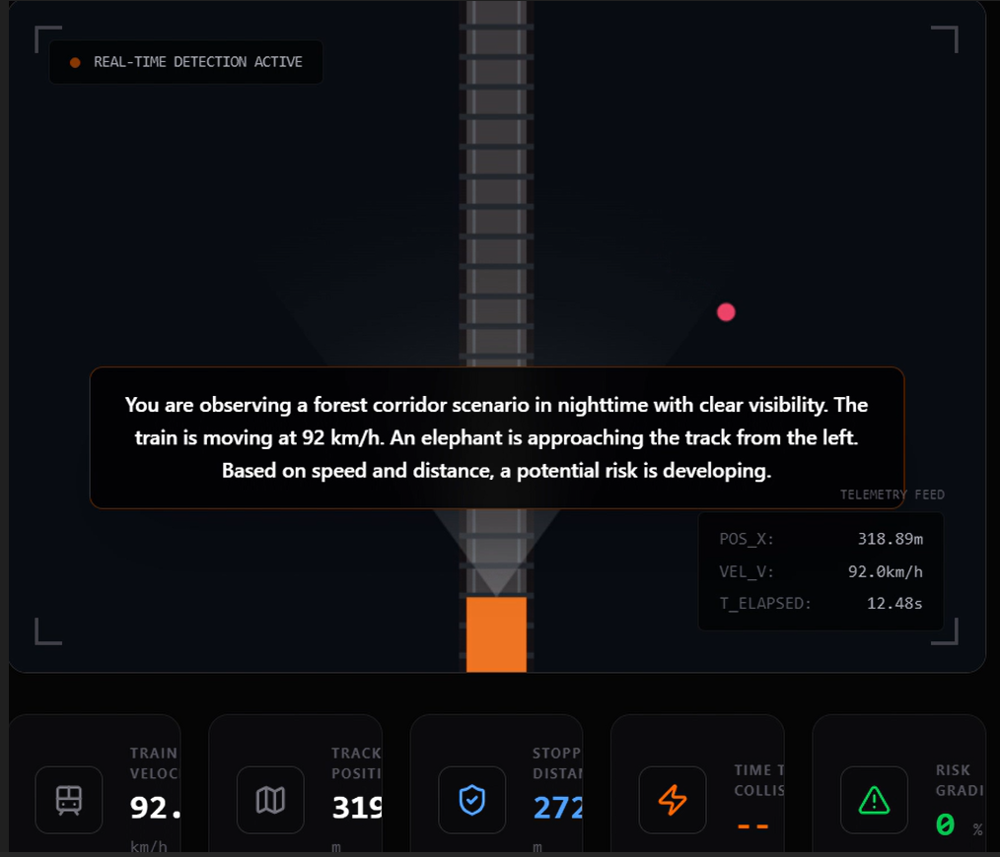
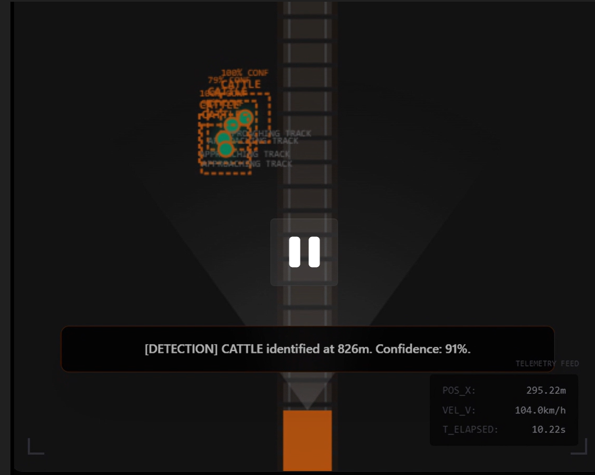
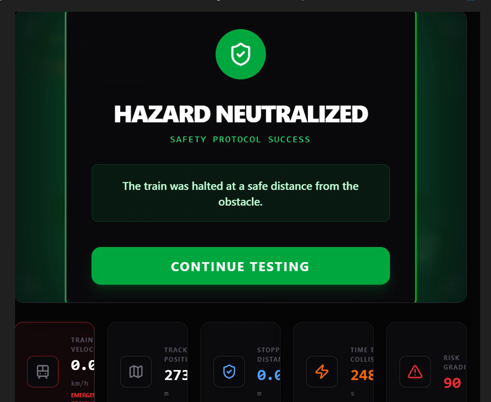

# TrackSafe AI Simulation Platform

## Overview

TrackSafe AI Simulation Platform is an AI-powered railway safety solution designed to detect and monitor wildlife and human intrusions near railway tracks. The platform demonstrates how computer vision, real-time monitoring, and automated alert systems can help reduce collision risks and improve railway safety.

This project was developed as part of an innovation proposal submitted to Indian Railways, focusing on the application of AI technologies for transportation safety and public infrastructure.

## Key Features

* Wildlife intrusion detection simulation
* Human intrusion detection simulation
* Real-time monitoring dashboard
* Automated alert generation
* Safety analytics and reporting
* Interactive visualization of railway safety scenarios

## Technology Stack

* React
* TypeScript
* Vite
* Tailwind CSS
* Gemini AI
* JavaScript

## Project Background

The project was conceived to address incidents involving wildlife and human movement on railway tracks. A prototype solution was developed and submitted through the Indian Railways innovation platform, accompanied by technical documentation, solution architecture, demonstration software, and implementation proposals.

The initiative also involved discussions with railway engineering stakeholders to better understand operational requirements, deployment considerations, and implementation challenges within large-scale railway systems.

## Screenshots

### Dashboard



### Intrusion Detection Module


### Alert Monitoring System



### Final Output:



## Installation

### Prerequisites

* Node.js
* Gemini API Key

### Setup

```bash
npm install
```

Run the application:

```bash
npm run dev
```

## Disclaimer

This project is a simulation and demonstration prototype developed for innovation and research purposes. It is not an official Indian Railways product and does not represent a deployed railway safety system.
